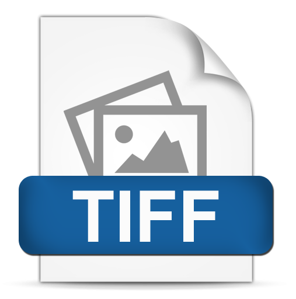
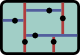

# Required Libraries

### [libLAS](http://www.liblas.org/) 

libLAS is a C/C++ library that reads and writes LAS files. As libLAS's Reader object reads the points in the file, the program adds the points to a kd-tree. libLAS's Header class is also important to obtain information about each LAS file.

### [libTIFF](http://www.remotesensing.org/libtiff/) 

LibTIFF is a library for reading and writing Tag Image File Format (TIFF) files. VoxGen requires libTIFF to create the LiDAR metrics flat files.

### [GDAL](http://www.gdal.org/) 

GDAL is “a translator library for raster and vector geospatial data formats.” In this program, GDAL is used to read the .tif files providing metrics for the LiDAR data. The GDAL API provides functions to open files and get data from the raster for an individual pixel.

### [Boost](http://www.boost.org/) 

Boost is a library that in VoxGen allows processing of an entire directory at once using its filesystem class. A user can choose whether to run VoxGen on a directory or on a single file.

### [kdtree](https://code.google.com/p/kdtree/) 

kdtree is a simple C library that creates and iterates through kd-trees. Kd-trees are k-dimensional binary search trees. In this case, our kd-tree operates in three dimensions corresponding to the x, y, and z values for each point in the LAS file.

The kdtree library has a function to add points to a kd-tree object along with a function to determine the points within a given range of some point.

## Obtaining Libraries
All libraries but kdtree may be installed from Synaptic Package Manager or through their project websites.
